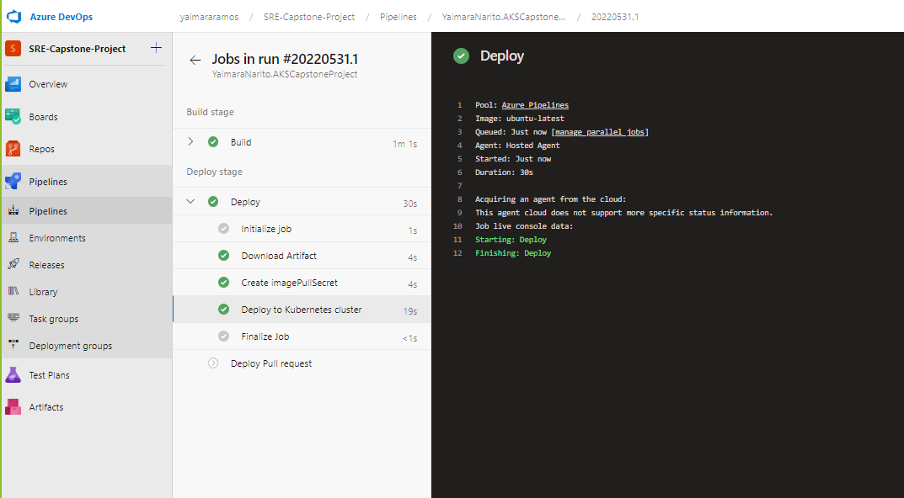

# AKSCapstoneProject

## Description
Project utilizes AKS to host a docker container with a node.js application

## Table of Contents

- [Links](#links)
- [Installation](#installation)
- [Usage](#usage)
- [Screenshots](#screenshots)
- [Testing](#testing)
- [License](#license)
- [Contributors](#contributors)

 ## Links
https://github.com/YaimaraNarito/AKSCapstoneProject


 ## Installation
To install necessary dependencies, run the following command:

```
Please install the Azure CLI and Kubectl
https://docs.microsoft.com/en-us/cli/azure/
https://kubernetes.io/docs/tasks/tools/

As well as Docker and Terraform
https://docs.docker.com/get-docker/
https://www.terraform.io/downloads
```

 ## Usage
 1. Create github repo and clone all files into it
 2. Create a Docker container
 ```
 docker build -t davidsdeveloper/llyd:v2 .

 docker run -it --name llyd -d -p 3001:3001 davidsdeveloper/llyd:v2

 docker push davidsdeveloper/llyd:v2

 ```
 3. Login to Azure on command line using: 
    ```
    az login
    ```
 4. Create namespaces deveopment, qa, staging, production:
    ```
    kubectl create ns development
    kubectl create ns qa
    kubectl create ns staging
    kubectl create ns production
    ```
 5. Create the cluster:

    Run Terraform commands
    ```
    terraform init
    terraform validate
    terraform plan -out tfplan.out
    terraform apply tfplan.out
    ```
 6. Login to cluster using:
     ```
     az aks get-credentials --resource-group aks-rg3 --name aks-cluster
     ```
 7. Create a Project on dev.azure.com
 8. Create build pipeline connected to github repo associated with code source, link to Azure subscription
 9. Create release pipeline with artifact and stages (development, qa, staging, production)

 ## Screenshots




 ## Testing
Run this commands on your CLI then get the EXTERNAL-IP of each to test your application on the browser.

```
kubectl get svc -n development
kubectl get svc -n qa
kubectl get svc -n staging
kubectl get svc -n production
```
In the browser:

```
<EXTERNAL-IP>/ping
<EXTERNAL-IP>/version
<EXTERNAL-IP>/<random-number>
```
Example:
Development: 20.106.44.210/ping
QA: 20.106.45.162/ping
Staging: 20.106.45.115/ping
Production: 20.106.45.120/ping

 ## License
This project is not licensed

 ## Contributors

[davids.developer@outlook.com](mailto:davids.developer@outlook.com)
Github Repo: [davidschepis](https://github.com/davidschepis).

[ha.cki@hotmail.es](mailto:ha.cki@hotmail.es)
Github Repo: [liuvis05](https://github.com/liuvis05).

[yaimara.r.nar@gmail.com](mailto:yaimara.r.nar@gmail.com)
Github Repo: [YaimaraNarito](https://github.com/YaimaraNarito).

[lexington.Johnson@icloud.com](mailto:lexington.johnson@icloud.com)
Github Repo: [Notgnixel](https://github.com/Notgnixel).


